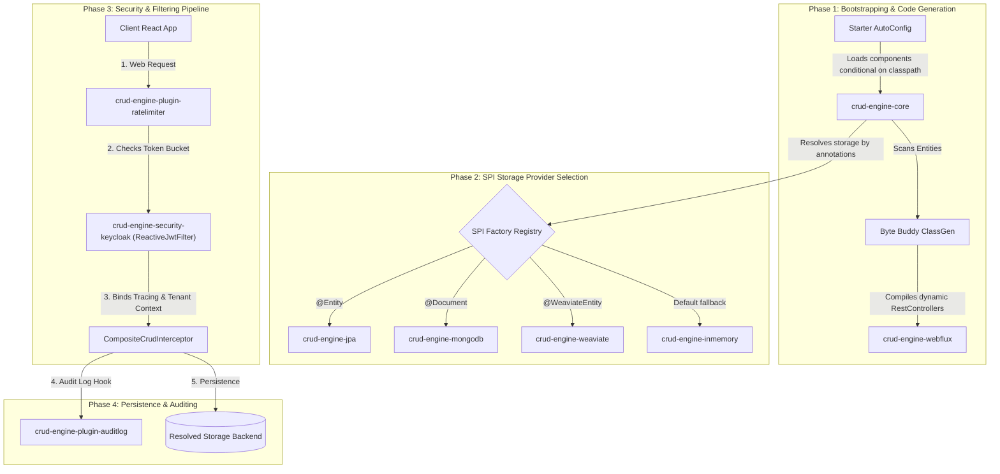

# Generic Spring Boot WebFlux CRUD Engine & Frontend Dashboard (v4.0)

[](https://github.com/73N37/Crud_application/actions/workflows/ci.yml)
[](https://jdk.java.net/25/)
[](https://spring.io/projects/spring-boot)
[](https://spring.io/projects/spring-framework)
[](https://www.keycloak.org/)
An educational, enterprise-ready, metadata-driven CRUD engine and frontend testing panel designed to teach students **advanced software engineering principles**, design patterns, and modern reactive security patterns.

---

## 📖 Introduction: Why This Project?

Traditional applications require developers to write repetitive controllers, services, and repositories for every single database entity (e.g., `Product`, `User`, `Order`). This is called **boilerplate code**.

This project implements a **Generic CRUD Engine** refactored into a **fully compartmentalized, pluggable submodule architecture**. By defining a simple database entity class and annotating it, the engine **dynamically generates** and secures HTTP endpoints at runtime using **Byte Buddy** class generation and dynamic WebFlux functional mapping.

The backend is built as a **100% native Java application** running on a high-throughput, non-blocking Spring WebFlux reactive loop (Netty). The application features dynamic SPI storage selection (supporting SQL/JPA, MongoDB, Weaviate vector database, or pure InMemory map-based engines) and optional plugin auto-registration.

---

## 🏗️ Git Submodule Architecture (Maximum Modularity)

The parent repository `Crud_application` acts as a lightweight shell coordinating root build configurations and hosting the runnable sample application. All core frameworks, persistence adapters, and plugins are maintained as independent Git submodules hosted under the **7-3-N-3-7** GitHub organization:

```
crud-application/ (Main Shell Repository)
├── .gitmodules
├── pom.xml (Parent POM coordinating submodules)
├── crud-app-sample/ (Run-time executable app with local entities/tests)
└── [Submodules]
    ├── crud-engine-core/ (Core abstractions, reflection registries, SPIs, and dynamic class/routing registries)
    ├── crud-engine-security-keycloak/ (Keycloak OIDC reactive authentication & JWT validation filters)
    ├── crud-engine-webflux/ (Runtime WebFlux endpoints & dynamic controller loaders)
    ├── crud-engine-spring-boot-starter/ (Conditional auto-configuration bootstrapper including OIDC security autowiring)
    │
    ├── [Pluggable Storage Adapters]
    │   ├── crud-engine-jpa/ (JPA & Row-Level Security SQL database engine)
    │   ├── crud-engine-mongodb/ (Document-based MongoDB database engine)
    │   ├── crud-engine-inmemory/ (Map-based testing database engine)
    │   └── crud-engine-weaviate/ (Weaviate vector database engine for LLM/AI workloads)
    │
    └── [Optional Plugins]
        ├── crud-engine-plugin-ratelimiter/ (Token-bucket reactive rate limiter filter)
        └── crud-engine-plugin-auditlog/ (Unified entity lifecycle audit logger interceptor)
```

---

## 🛠️ Frameworks & Libraries Lifecycle Interplay

The following diagram illustrates how the integrated submodules collaborate during the application lifecycle:



### Integrated Submodules & Plugins:
*   **crud-engine-core**: Base annotations (`@CrudResource`, `@EntityMapping`), `BaseEntity` with tenancy, auditing & attribute maps, and the Service / Interceptor registry.
*   **crud-engine-security-keycloak**: Houses the enterprise-hardened Keycloak OIDC security layer — including the reactive security filter (`ReactiveJwtFilter`) that validates Keycloak tokens, extracts username/roles/tenant claims, enforces deny-by-default role-based access control, and propagates `TenantContext` across reactive thread boundaries. It is integrated as a permanent core submodule required by the starter so that security is always enabled.
*   **crud-engine-webflux**: Declares `UniversalCrudController` and dynamically maps routes at runtime. Uses optional autowiring to run without SQL/JPA if only NoSQL/InMemory is present.
*   **crud-engine-spring-boot-starter**: Auto-configures engine registries, security beans, and component scans based on classpath class existence.
*   **crud-engine-jpa**: Executes PostgreSQL criteria queries and handles Row-Level Security (RLS) policies.
*   **crud-engine-mongodb**: Dynamic document database persistence using `MongoTemplate` and regex-based filters.
*   **crud-engine-inmemory**: Ultra-fast Map-based storage provider, ideal for unit testing without external database infrastructure.
*   **crud-engine-weaviate**: Vector database persistence adapter powered by the Weaviate Java Client v6. Designed for AI/LLM workloads requiring semantic search and vector embeddings. Entities are routed here when annotated with `@WeaviateEntity`. Auto-configures via `WeaviateAutoConfiguration` and uses gRPC + HTTP to communicate with the Weaviate cluster.
*   **crud-engine-plugin-ratelimiter**: Reactive `WebFilter` implementing a thread-safe token bucket traffic limiter.
*   **crud-engine-plugin-auditlog**: Employs `AuditLoggingInterceptor` executing on `BaseEntity` class mapping to log CRUD operations contextually.

---

## ⚡ Design Patterns In Action

This codebase serves as a living laboratory for advanced Java design patterns:

1.  **Registry Pattern**: The `CrudEngine` maintains a registry of all endpoints, mapping URL paths (e.g. `/products`) to their database representations and DTO classes.
2.  **Strategy Pattern**: Use custom interceptors (implementing `CrudInterceptor`) to inject custom business validation or formatting strategies for specific resources (e.g., converting names to uppercase inside `ProductInterceptor`).
3.  **Template Method Pattern**: `CrudService` and `CrudInterceptor` define standard lifecycle hooks (`beforeCreate`, `afterCreate`, etc.). Extending classes override only what they need.
4.  **Service Provider Interface (SPI)**: `CrudStorageProviderFactory` allows multiple data stores to register their support for specific entities (e.g., MongoDB, JPA) dynamically based on annotations, enabling hot-swapping data layers.

---

## 🔒 Security Architecture: Enterprise-Hardened OIDC

The API is fully secured using **OAuth 2.0 / OpenID Connect (OIDC)** via Keycloak. The security layer (`ReactiveJwtFilter`, `SecurityConfig`, `SecurityAuditorAware`) is encapsulated in the `crud-engine-security-keycloak` submodule, integrated as a core dependency — every build of the starter is authenticated by construction.

```
Incoming HTTP request -> Header: Authorization: Bearer <JWT>
                         |
                         v
    ReactiveJwtFilter (Validates Token, extracts Username/Roles/Tenant)
                         |
                         +---> Checks authorization matching @CrudResource(roles = ...)
                         |
                         +---> Registers SecurityContext & Reactive Context variables
                         |
                         v
        Propagates TenantContext dynamically to JDBC/NoSQL boundary for RLS
```

*   **Public vs. Private Routes**: Routes are **deny-by-default** — `@CrudResource.roles()` defaults to an empty set, so a resource is inaccessible unless it explicitly lists allowed roles (or opts into public access with `ANYONE`). The `/api/metadata` endpoint is public; dynamic endpoints like `/api/products` require authentication and a matching role.
*   **PostgreSQL Row-Level Security (RLS)**: Database-level isolation restricts queries dynamically based on the active JWT tenant claim, preventing data exposure between tenants.
*   **Token-Bucket Rate Limiter**: Limits client requests to a max capacity of 50 requests/minute per IP, returning a standard `429 Too Many Requests` problem detail when exceeded.
*   **XSS Sanitization & Jackson Payload Restriction**: All incoming JSON payloads undergo global sanitization to strip dangerous script tags, and the deserializer is configured to strictly fail on unknown/unwhitelisted properties.
*   **Correlation Tracing**: A unique `requestId` is generated for each request and propagated across asynchronous thread boundaries using reactive logback MDC, matching log statements to specific web execution flows.

---

## 🚀 Getting Started: How to Run Locally

### Prerequisites
*   **Java 25 JDK** (e.g., Temurin)
*   **Maven 3.8+**
*   **Docker & Docker Compose**

### Step 1: Clone Submodules
Since the project relies on Git submodules, clone it using:
```bash
git clone --recursive https://github.com/73N37/Crud_application.git
```
Or if already cloned:
```bash
git submodule update --init --recursive
```

### Step 2: Start Infrastructure Services
Spin up the infrastructure containers inside Docker in background mode:
```bash
docker-compose up -d
```
*This starts:*
1.  **PostgreSQL** on port `5433` (preventing conflicts with local Postgres installations on 5432).
2.  **Keycloak** on port `8081` with the `/auth` path prefix (Admin Credentials: `admin` / `admin`, Admin Console: `http://localhost:8081/auth/admin`).

> **Optional — Weaviate:** If you intend to use the `crud-engine-weaviate` storage adapter, start a local Weaviate instance:
> ```bash
> docker run -d --name crud-weaviate \
>   -p 9090:8080 -p 50051:50051 \
>   cr.weaviate.io/semitechnologies/weaviate:latest
> ```
> Then add the following to your `application.properties`:
> ```properties
> crud.engine.weaviate.host=localhost:9090
> crud.engine.weaviate.grpc-port=50051
> ```

### Step 3: Run the Backend Application
Start the Spring Boot WebFlux server:
```bash
mvn spring-boot:run -pl crud-app-sample
```
The server will boot up on `http://localhost:8080`.

### Step 4: Run the Frontend (Included Repository)
The interactive React TypeScript custom dashboard frontend is maintained in the `crud-frontend` directory:

To run it locally:
1. Navigate to the frontend directory:
   ```bash
   cd crud-frontend
   ```
2. Install dependencies:
   ```bash
   npm install
   ```
3. Start the Vite development server:
   ```bash
   npm run dev
   ```
The frontend will boot up on `http://localhost:5173`.
Alternatively, you can access the dashboard through `/dashboard/`.


---

## 🧪 Running Automated Tests

To compile the project and execute the backend integration tests, run:
```bash
mvn clean test
```
The test suite (`CrudAppIntegrationTest.java`) covers 14 test cases across the WebFlux pipelines, verifying dynamic controller generation, rate limiting, role-based access, correlation tracing, and auditing.
