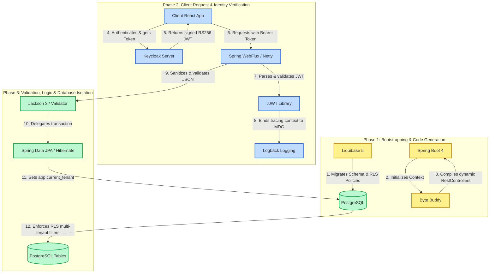
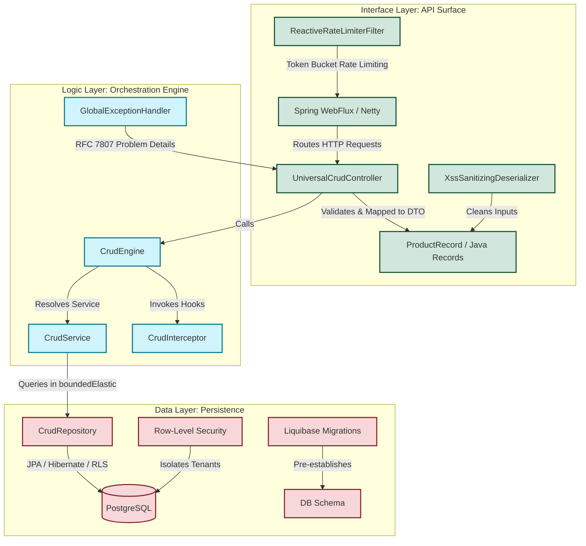

# Generic Spring Boot WebFlux CRUD Engine & Frontend Dashboard (v2.0)

[](https://github.com/73N37/Crud_application/actions/workflows/ci.yml)
[](https://jdk.java.net/25/)
[](https://spring.io/projects/spring-boot)
[](https://spring.io/projects/spring-framework)
[](https://www.keycloak.org/)

An educational, enterprise-ready, metadata-driven CRUD engine and frontend testing panel designed to teach students **advanced software engineering principles**, design patterns, and modern reactive security patterns.

---

## 📖 Introduction: Why This Project?

Traditional applications require developers to write repetitive controllers, services, and repositories for every single database entity (e.g., `Product`, `User`, `Order`). This is called **boilerplate code**.

This project implements a **Generic CRUD Engine**. By defining a simple database entity class and annotating it, the engine **dynamically generates** and secures HTTP endpoints at runtime using **Byte Buddy** class generation and dynamic WebFlux functional mapping. You write the infrastructure once, and the application expands dynamically.

The backend is built as a **100% native Java application** running on a high-throughput, non-blocking Spring WebFlux reactive loop (Netty), completely auditing and verifying the elimination of custom Python scripts from all runtime and build pipelines.

---

## 🛠️ Frameworks & Libraries Lifecycle Interplay

The following diagram illustrates how all the integrated enterprise libraries and frameworks collaborate during the application lifecycle (from bootstrap-time code generation to request-time security validation and database persistence):



### Integrated Frameworks & Libraries Index:
*   **Spring Boot 4 & WebFlux (Netty)**: Non-blocking web server engine executing high-concurrency event loops.
*   **Byte Buddy**: Compiles and registers dynamic REST controller classes during Spring's bootstrap scanning phase.
*   **Keycloak**: Enterprise Identity and Access Management (IAM) server issuing signed OAuth2 JWTs.
*   **JJWT**: Parses and validates the cryptographic signatures of JWT claims against Keycloak certificates.
*   **Logback**: Provides logging services with Mapped Diagnostic Context (MDC) parameters to trace requests asynchronously.
*   **Jackson 3 (Databind)**: JSON parser stripping XSS scripting tags and rejecting unwhitelisted fields.
*   **Spring Data JPA & Hibernate**: Object-relational mapping querying database views and executing RLS settings.
*   **Liquibase**: Declarative migration engine version-controlling schema schemas and database parameters.
*   **PostgreSQL**: Secure relational database running Row-Level Security (RLS) isolation logic.

---

## 🏗️ Architectural Framework: Data-Logic-Interface (DLI)

To maintain a clean system, this project enforces the **Data-Logic-Interface (DLI)** pattern. Each layer has strict responsibilities and boundaries:



### 1. Data Layer (`com.example.crudapp.data`)
*   **Responsibility**: Database schemas, entities, and raw persistence.
*   **Key Components**: `BaseEntity` (provides hierarchical Parent-Child mapping), `CrudRepository` (encapsulates Hibernate JPA queries), and schema-defining entities like `Product`.
*   **Tenant Isolation**: Implemented via PostgreSQL **Row-Level Security (RLS)** at the database layer. Transactions set a local parameter `app.current_tenant` to restrict records visibility contextually.

### 2. Logic Layer (`com.example.crudapp.logic`)
*   **Responsibility**: Business rules validation, dynamic resource discovery, and lifecycle orchestration.
*   **Key Components**: `CrudEngine` (scans, registers, and maps components), `CrudService` (generic business queries), and interceptors (custom lifecycle hooks).
*   **Exception Mapping**: Spring Boot's native **RFC 7807 Problem Details** support is integrated. `GlobalExceptionHandler` converts validation failures, optimistic locking conflicts, security violations, and database integrity failures into standard Problem Details JSON payloads.

### 3. Interface Layer (`com.example.crudapp.api`)
*   **Responsibility**: Exposing the API surface, validating input request payloads, and handling HTTP routing.
*   **Key Components**: `DynamicControllerRegister` (generates RestControllers via Byte Buddy at runtime), `UniversalCrudController` (handles generic requests), and `Records` (immutable DTOs like `ProductRecord`).
*   **Security Filters**: Includes `ReactiveRateLimiterFilter` (token-bucket rate limiting), CORS origin whitelisting filters, and standard input sanitizers like the global `XssSanitizingDeserializer` to prevent cross-site scripting (XSS).

---

## ⚡ Design Patterns In Action

This codebase serves as a living laboratory for advanced Java design patterns:

1.  **Registry Pattern**: The `CrudEngine` maintains a registry of all endpoints, mapping URL paths (e.g. `/products`) to their database representations and DTO classes.
2.  **Strategy Pattern**: Use custom interceptors (implementing `CrudInterceptor`) to inject custom business validation or formatting strategies for specific resources (e.g., converting names to uppercase inside `ProductInterceptor`).
3.  **Template Method Pattern**: `CrudService` and `CrudInterceptor` define standard lifecycle hooks (`beforeCreate`, `afterCreate`, etc.). Extending classes override only what they need.

---

## 🔒 Security Architecture: Enterprise-Hardened OIDC

The API is fully secured using **OAuth 2.0 / OpenID Connect (OIDC)** via Keycloak.

```
Incoming HTTP request -> Header: Authorization: Bearer <JWT>
                         |
                         v
    ReactiveJwtFilter (Validates Token, extracts Username/Roles/Tenant)
                         |
                         +---> Checks authorization matching @CrudResource(roles = ...)
                         |
                         +---> Registers SecurityContext & Reactive Context variables
                         |
                         v
       Propagates TenantContext dynamically to JDBC boundary for RLS
```

*   **Public vs. Private Routes**: The `/api/metadata` endpoint is public. Dynamic endpoints like `/api/products` are secured and require authentication.
*   **PostgreSQL Row-Level Security (RLS)**: Database-level isolation restricts queries dynamically based on the active JWT tenant claim, preventing data exposure between tenants.
*   **Token-Bucket Rate Limiter**: Limits client requests to a max capacity of 50 requests/minute per IP, returning a standard `429 Too Many Requests` problem detail when exceeded.
*   **XSS Sanitization & Jackson Payload Restriction**: All incoming JSON payloads undergo global sanitization to strip dangerous script tags, and the deserializer is configured to strictly fail on unknown/unwhitelisted properties.
*   **Correlation Tracing**: A unique `requestId` is generated for each request and propagated across asynchronous thread boundaries using reactive logback MDC, matching log statements to specific web execution flows.

---

## 📦 Database Migrations & Validation

Instead of letting Hibernate auto-generate the database schema (`ddl-auto=update`), which is risky for production systems, this project uses **Liquibase**.
*   **Version Control for DB**: All database migrations are described declaratively in `db.changelog-master.xml`.
*   **Idempotency**: Table generation uses `<preConditions>` to run safely without breaking existing data.
*   **Validation Mode**: Hibernate validation is set to `validate` (`spring.jpa.hibernate.ddl-auto=validate`) to verify that the database structure generated by Liquibase matches our Java JPA entities perfectly.

---

## 🚀 Getting Started: How to Run Locally

### Prerequisites
*   **Java 25 JDK** (e.g., Temurin)
*   **Maven 3.8+**
*   **Docker & Docker Compose**

### Step 1: Start PostgreSQL & Keycloak
Spin up the PostgreSQL and Keycloak databases inside Docker in background mode:
```bash
docker-compose up -d
```
*This starts:*
1.  **PostgreSQL** on port `5433` (preventing conflicts with local Postgres installations on 5432).
2.  **Keycloak** on port `8081` (Admin Credentials: `admin` / `admin`).

### Step 2: Configure Keycloak Realm (Manual Step)
1.  Navigate to the admin console: `http://localhost:8081/admin` and log in.
2.  Create a realm named `crud-realm`.
3.  Under **Users**, create a test user (e.g., `test-user`).
4.  Under **Realm Roles**, create roles `ADMIN` and `USER`, and assign them to your user.

### Step 3: Run the Backend Application
Start the Spring Boot WebFlux server:
```bash
mvn spring-boot:run
```
The server will boot up on `http://localhost:8080`.

### Step 4: Run the Frontend (Separate Repository)
The interactive React-TypeScript frontend is maintained in its own repository:

> 🎨 **[73N37/Crud_frontend](https://github.com/73N37/Crud_frontend)**

To run it locally:
1. Clone the frontend repository:
   ```bash
   git clone https://github.com/73N37/Crud_frontend.git
   cd Crud_frontend
   ```
2. Install dependencies:
   ```bash
   npm install
   ```
3. Start the development server:
   ```bash
   npm run dev
   ```
The frontend will boot up on `http://localhost:5173`. It is configured via environment variables (see `.env.development` and `.env.production`) to connect to the backend API.

---

## 🎨 Standalone Frontend Dashboard
The React frontend dashboard has been separated into its own repository: [73N37/Crud_frontend](https://github.com/73N37/Crud_frontend). It serves as:
1.  **Architecture Visualizer**: An interactive graphical schematic mapping core architectural design patterns.
2.  **Web Crypto RS256 Signer**: Signs standard OIDC JWT authorization tokens natively in the browser using Web Crypto APIs.
3.  **Dynamic CRUD Tester**: Reads validation constraints and field DTO attributes from the backend `/api/metadata` endpoint.

---

## 🧪 Running Automated Tests

To compile the project and execute the backend integration tests, run:
```bash
mvn clean test
```
The test suite (`CrudAppIntegrationTest.java`) covers 14 test cases across the WebFlux pipelines.

Frontend E2E Playwright tests are now managed and executed in the frontend repository against the deployed backend.

---

## ⛓️ Continuous Integration (CI) with GitHub Actions

The CI/CD pipeline in this repository is defined in `.github/workflows/ci.yml`:

### `ci.yml` — Build & Test Pipeline
Runs on every push and pull request to `main` / `master`.
- **`build` job**: Spins up a PostgreSQL service container, sets up JDK 25, and runs `mvn clean test` (14 integration tests).
- **Timeout**: 10 minutes hard cap to prevent runaway builds.

---

## 🌐 Live Deployment & Hosting

### Frontend
Hosted on GitHub Pages at:
> 🌐 **https://73n37.github.io/Crud_frontend/**

### Backend
Hosted on DigitalOcean App Platform at:
> 🌐 **https://crud-api-placeholder.ondigitalocean.app**

