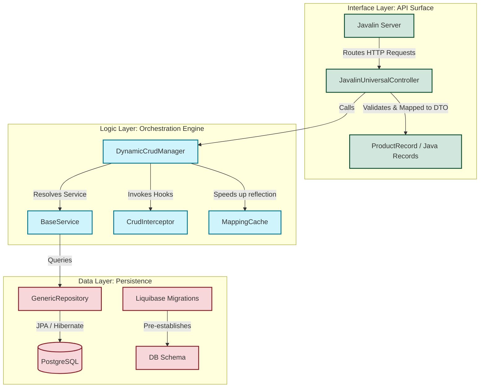

# Generic Spring Boot & Javalin CRUD Engine (v2.0)

[](https://github.com/73N37/Crud_application/actions/workflows/ci.yml)
[](https://jdk.java.net/25/)
[](https://spring.io/projects/spring-boot)
[](https://javalin.io/)
[](https://www.keycloak.org/)

An educational, enterprise-ready, metadata-driven CRUD engine designed to teach students **advanced software engineering principles**, design patterns, and modern security patterns.

---

## 📖 Introduction: Why This Project?

Traditional applications require developers to write repetitive controllers, services, and repositories for every single database entity (e.g., `Product`, `User`, `Order`). This is called **boilerplate code**.

This project implements a **Generic CRUD Engine**. By defining a simple database entity class and annotating it, the engine **dynamically generates** and secures HTTP endpoints at runtime. You write the infrastructure once, and the application expands dynamically.

---

## 🏗️ Architectural Framework: Data-Logic-Interface (DLI)

To maintain a clean system, this project enforces the **Data-Logic-Interface (DLI)** pattern. Each layer has strict responsibilities and boundaries:



### 1. Data Layer (`com.example.crudapp.data`)
*   **Responsibility**: Database schemas, entities, and raw persistence.
*   **Key Components**: `BaseEntity` (provides hierarchical Parent-Child mapping), `GenericRepository` (encapsulates Hibernate JPA queries), and schema-defining entities like `Product`.
*   **Constraint**: This layer has zero knowledge of HTTP requests, API models (DTOs), or authentication mechanisms.

### 2. Logic Layer (`com.example.crudapp.logic`)
*   **Responsibility**: Business rules validation, dynamic resource discovery, and lifecycle orchestration.
*   **Key Components**: `DynamicCrudManager` (scans, registers, and maps components), `BaseService` (generic business queries), and `MappingCache` (accelerates reflection metadata mappings).
*   **Constraint**: Acts as the central transaction-boundary manager. It bridges entities (Data) to records (Interface) without coupling them directly.

### 3. Interface Layer (`com.example.crudapp.api`)
*   **Responsibility**: Exposing the API surface, validating input request payloads, and handling HTTP routing.
*   **Key Components**: `JavalinServer` (bootstraps Javalin), `JavalinUniversalController` (handles generic requests), and `Records` (immutable DTOs like `ProductRecord`).
*   **Constraint**: Never directly accesses the database. DTOs are strictly immutable, matching client communication contracts.

---

## ⚡ Design Patterns In Action

This codebase serves as a living laboratory for advanced Java design patterns:

1.  **Registry Pattern**: The `DynamicCrudManager` maintains a registry of all endpoints, mapping URL paths (e.g. `/products`) to their database representations and DTO classes.
2.  **Strategy Pattern**: Use custom interceptors (implementing `CrudInterceptor`) to inject custom business validation or formatting strategies for specific resources (e.g., converting names to uppercase inside `ProductInterceptor`).
3.  **Template Method Pattern**: `BaseService` and `CrudInterceptor` define standard lifecycle hooks (`beforeCreate`, `afterCreate`, etc.). Extending classes override only what they need.
4.  **Flyweight/Caching Pattern**: The `MappingCache` holds constructor and field reflection references, avoiding costly JDK reflection lookups during entity-DTO transformations.

---

## 🔒 Security Architecture: Keycloak IAM Integration

The API is fully secured using **OAuth 2.0 / OpenID Connect (OIDC)** via Keycloak.

```
Incoming HTTP request -> Header: Authorization: Bearer <JWT>
                        |
                        v
    JwtInterceptor (Parses JWT, decodes Key ID 'kid')
                        |
                        +---> Verifies signature (RS256) via JWKS
                        |
                        +---> Extracts user name (preferred_username)
                        |
                        +---> Extracts user roles (realm_access.roles)
                        |
                        v
      Checks authorization matching @CrudResource(roles = ...)
```

*   **Public vs. Private Routes**: The `/api/v2/metadata` endpoint is public. Dynamic endpoints like `/api/v2/products` are secured and require authentication.
*   **JWKS (JSON Web Key Sets)**: The `JwtInterceptor` fetches Keycloak's public certificates on demand from the certificate URI and caches them dynamically to prevent network latency.
*   **Role-Based Access Control (RBAC)**: Allowed roles are specified on the entity class (e.g. `@CrudResource(roles={"ADMIN", "USER"})`). The interceptor automatically validates that the JWT contains a matching role.
*   **Mock Verification for Tests**: To keep tests fast and independent of the Keycloak container, tests generate a local RSA keypair, register the public key using `@DynamicPropertySource`, and sign test tokens dynamically.

---

## 📦 Database Migrations with Liquibase

Instead of letting Hibernate auto-generate the database schema (`ddl-auto=update`), which is risky for production systems, this project uses **Liquibase**.
*   **Version Control for DB**: All database migrations are described declaratively in `db.changelog-master.xml`.
*   **Idempotency**: Table generation uses `<preConditions>` to run safely without breaking existing data.
*   **Validation Mode**: Hibernate validation is set to `validate` (`spring.jpa.hibernate.ddl-auto=validate`) to verify that the database structure generated by Liquibase matches our Java JPA entities perfectly.

---

## 🚀 Getting Started: How to Run Locally

### Prerequisites
*   **Java 25 JDK** (e.g., Temurin)
*   **Maven 3.8+**
*   **Docker & Docker Compose**

### Step 1: Start PostgreSQL & Keycloak
Spin up the PostgreSQL and Keycloak databases inside Docker in background mode:
```bash
docker-compose up -d
```
*This starts:*
1.  **PostgreSQL** on port `5433` (preventing conflicts with local Postgres installations on 5432).
2.  **Keycloak** on port `8081` (Admin Credentials: `admin` / `admin`).

### Step 2: Configure Keycloak Realm (Manual Step)
1.  Navigate to the admin console: `http://localhost:8081/admin` and log in.
2.  Create a realm named `crud-realm`.
3.  Under **Users**, create a test user (e.g., `test-user`).
4.  Under **Realm Roles**, create roles `ADMIN` and `USER`, and assign them to your user.

### Step 3: Run the Application
Start the Spring Boot container:
```bash
mvn spring-boot:run
```
The server will boot up and start Javalin on port `8080`.

### Step 4: Interact with the APIs
*   **Public Metadata**: `GET http://localhost:8080/api/v2/metadata`
*   **Swagger API Docs**: `http://localhost:8080/swagger-ui.html`
*   **Secure API Endpoint**: `GET http://localhost:8080/api/v2/products`
    *(Requires a Bearer JWT Token in the headers acquired from Keycloak!)*

---

## 🧪 Running Automated Tests

To compile the project and execute the integration tests, run:
```bash
mvn clean test
```
The test suite (`CrudAppIntegrationTest.java`) tests the metadata registry, successful secure queries, role validation checks (403 Forbidden), and authorization rejections (401 Unauthorized) using mocked RSA tokens.

---

## ⛓️ Continuous Integration (CI) with GitHub Actions

A Continuous Integration pipeline is configured at `.github/workflows/ci.yml`:
*   **Triggers**: On every push and pull request to the repository.
*   **Runner**: Running on an isolated `ubuntu-latest` VM.
*   **Database Service**: Spins up a real PostgreSQL service container in the runner (exposed on port `5433`).
*   **Execution**: Validates compilation, pulls cached Maven dependencies, and runs tests to guarantee build health.
