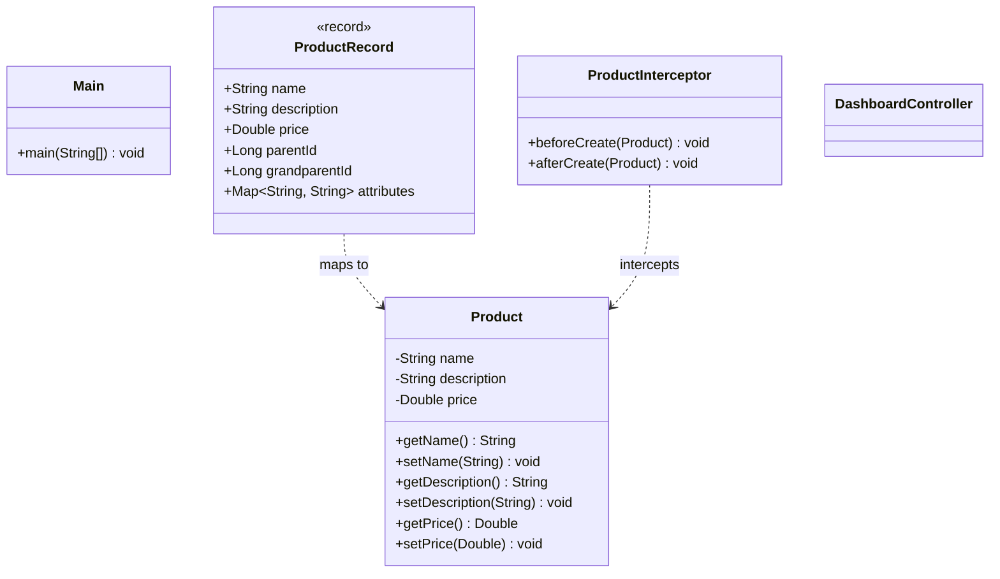
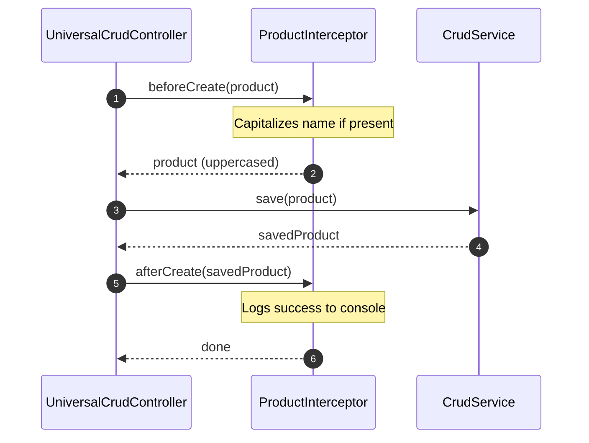

# Sample App Module Architecture (Mermaid)

This file contains Mermaid diagrams visualizing the structure and design of the sample application (`crud-app-sample`).

## 1. Class Structure

## 2. Product Mutation Lifecycle Interceptor Flow

