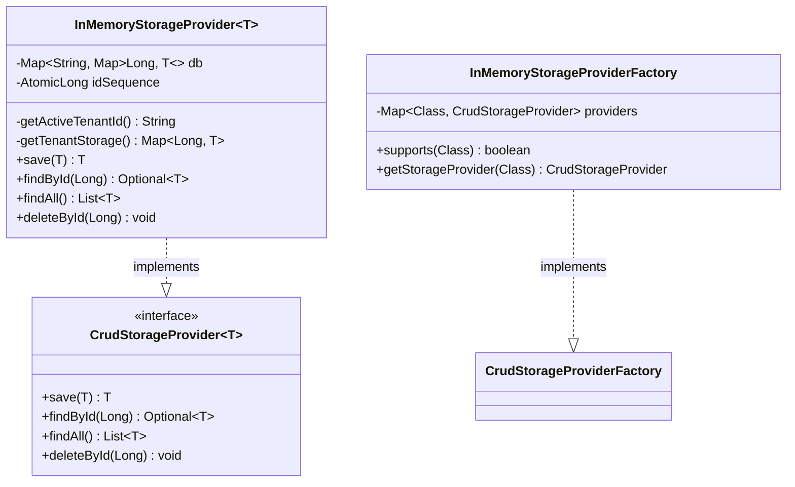
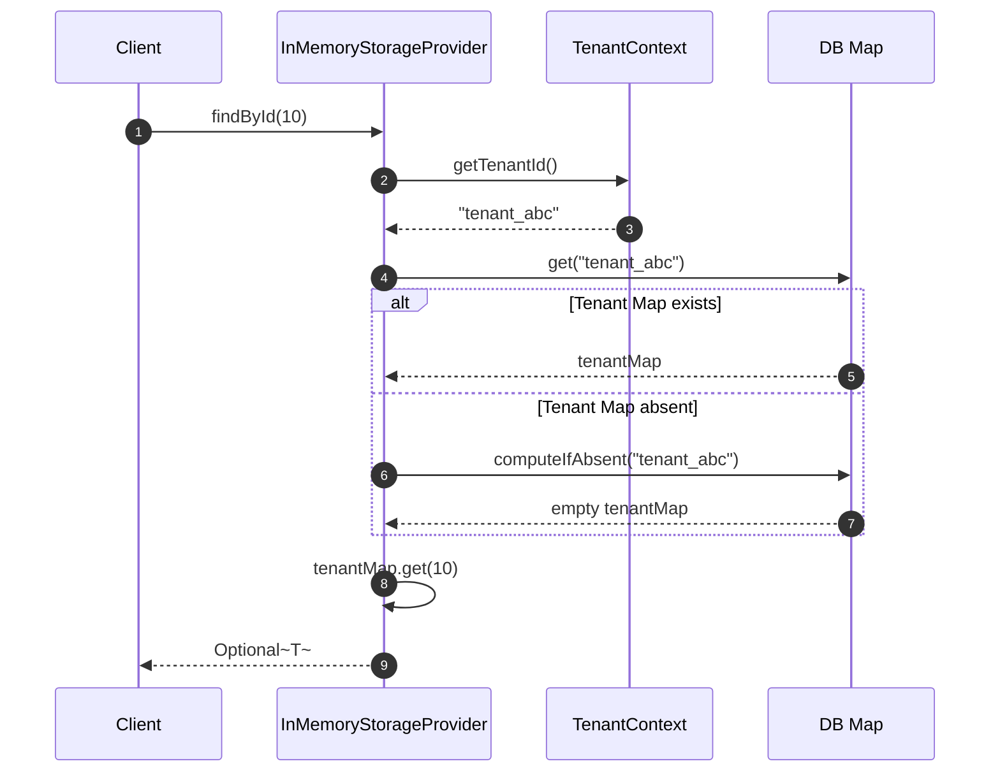

# In-Memory Storage Module Architecture (Mermaid)

This file contains Mermaid diagrams visualizing the structure and design of the in-memory storage module (`crud-engine-inmemory`).

## 1. Class Structure

## 2. In-Memory Tenant Lookup Sequence

