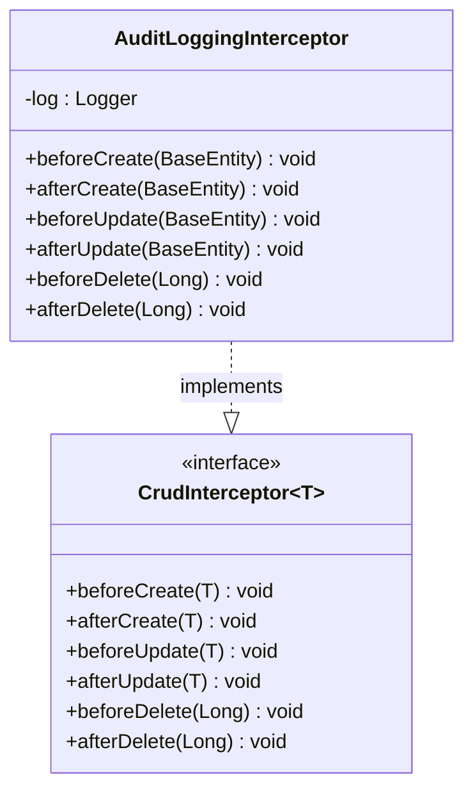
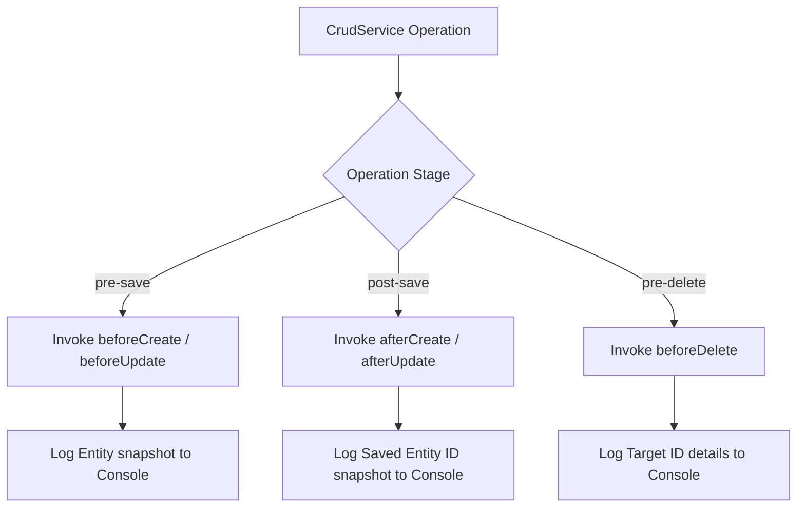

# Audit Log Module Architecture (Mermaid)

This file contains Mermaid diagrams visualizing the structure and design of the Audit Log plugin (`crud-engine-plugin-auditlog`).

## 1. Class Structure

## 2. Dynamic Interception Flow

