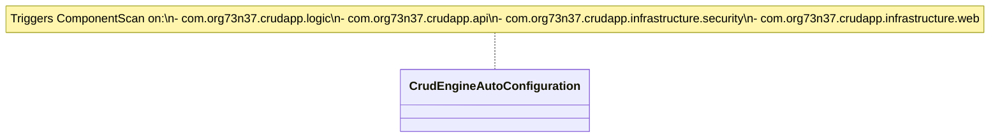
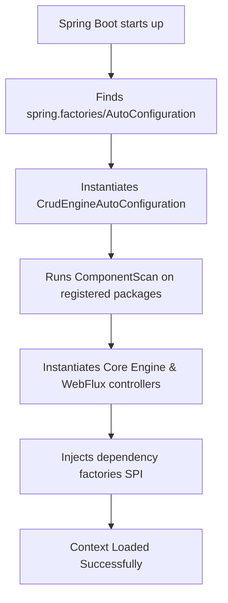

# Spring Boot Starter Module Architecture (Mermaid)

This file contains Mermaid diagrams visualizing the structure and design of the Spring Boot auto-configuration starter (`crud-engine-spring-boot-starter`).

## 1. Class Structure

## 2. Bootstrapping Flow

