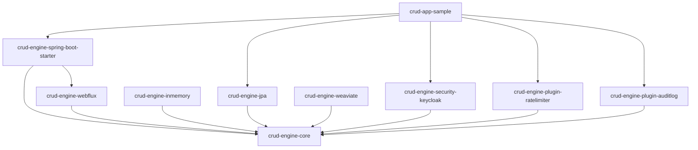
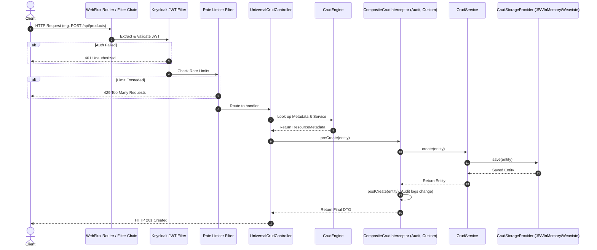
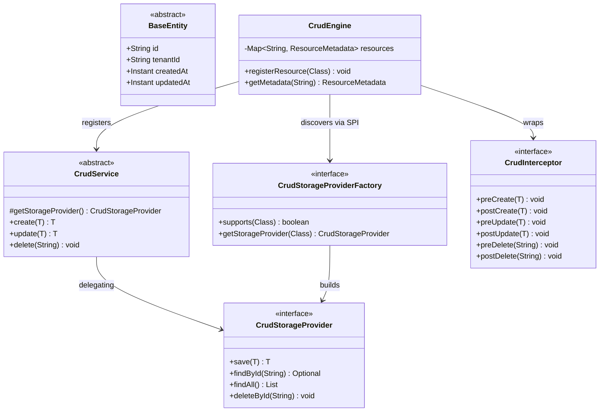

# Workspace Architecture (Mermaid Diagrams)

This document contains top-level visual diagrams showing how all sub-modules interplay in the Zero-Code CRUD Engine platform.

## 1. Submodule Dependency Graph

## 2. Core Request Flow (Sequence View)

## 3. Class Hierarchy and SPI Architecture

